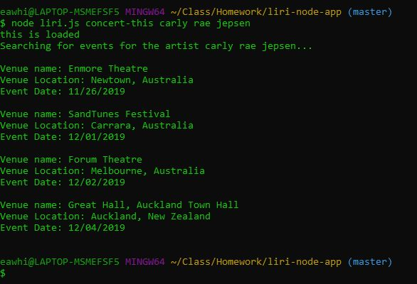
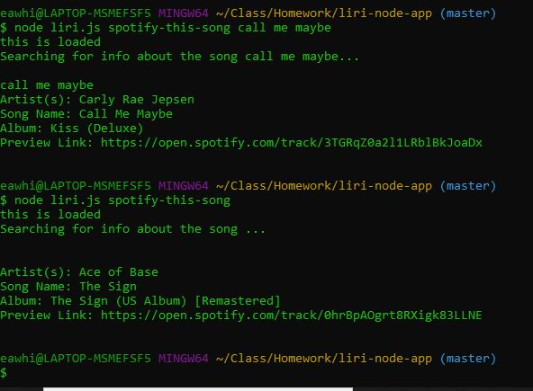
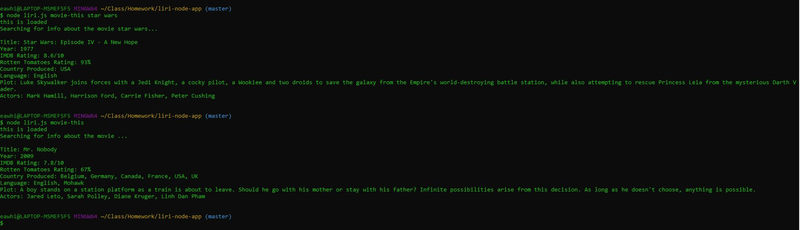
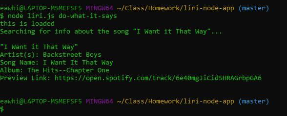

# Purpose
This application simulates a very low-rent Siri. It allows the user to search for a movie, a band, or a song and get info about that search term by querying a relevant API.

# Oragnization
This app is fairly simply laid out- almost everything lives in liri.js. Arguments are just taken from the command line, and a switch statement parses which command to run based off of the user input. Each search is broken off into its own function.

# Running the App

To run the app, you need to locally install all of the required packages (moment, axios, spotify), and create a .env file with your spotify ID / Secret combination. Then you can run the application using node on the liri.js file with one of the following four commands:

1. node liri.js concert-this <band> 
2. node liri.js spotify-this-song <song>
3. node liri.js movie-this <movie> 
4. node liri.js do-what-it-says

The first three commands will get you information about a band's showtimes, a song, or a movie respectively. The final command will read the "random.txt" file and excecute what command / search term combo is stored in there.

# Demo Screenshots

Here I've searched for the artist Carly Rae Jepsen, and found her upcoming shows.

Here's I've searched for the song "Call Me Maybe" and received info about it. I've also done a second search with no parameter, and gotten the default info for The Sign by Ace of Base.

Here I've searched for movie info about Star Wars. I've also done a search with no parameter, and gotten info about Mr. Nobdy.

Here I've searched based off of the contents of the file, which I've set as the default per the instructions (searching for "I Want it That Way")